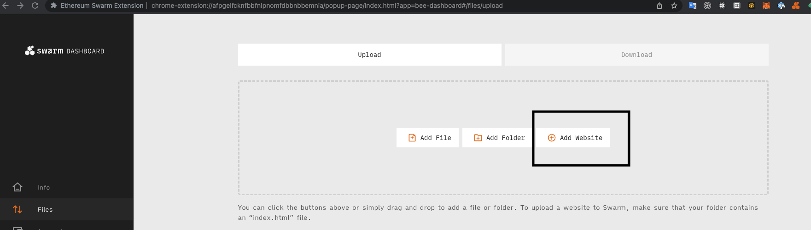
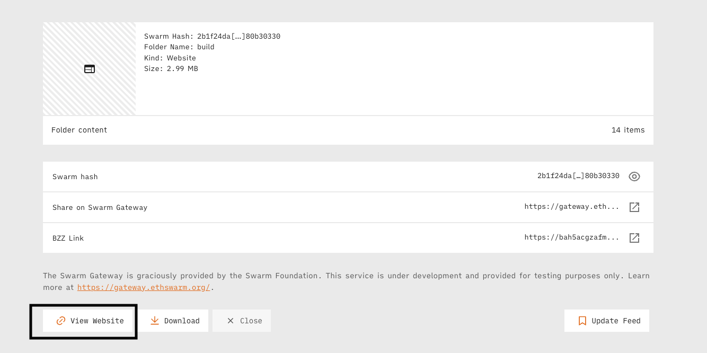

# fdp-slate

Slate editor FDP integration

## Requirements

-   Fdp-play
-   Blossom Extension
-   Swarm Extension

## Installation

1. Clone repository
2. Run `npm install`
3. npm run build
4. upload build folder as Website on Swarm
   
5. Click on view Website
   

## Using fdp-slate

### New file

### Save file

### Open file

### Markdown mode

TODO

## Component Diagram
